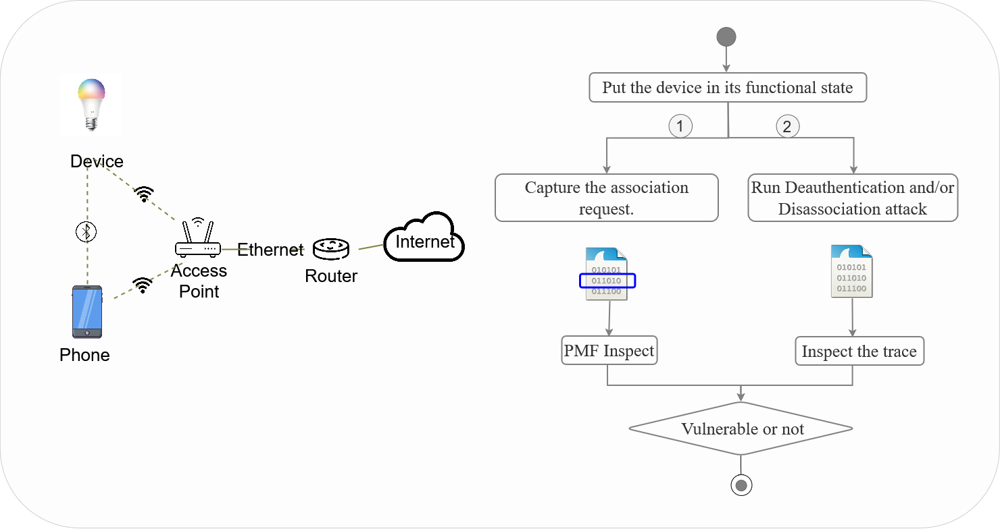

# PMFInspect

PMFInspect is a **defensive evaluation tool** designed to assess whether an IoT device correctly implements **Protected Management Frames (PMF – IEEE 802.11w)** and to evaluate its robustness against management-frame–based disruptions (e.g., deauthentication and disassociation events).

> ⚠️ Responsible Use  
> Use PMFInspect **only** on devices and networks you own or are explicitly authorized to test.  
> This tool is intended for security auditing and research purposes in controlled lab environments.

---

## Objectives

PMFInspect helps to:

- Determine the advertised PMF configuration via RSN capabilities (**MFPC / MFPR bits**)
- Verify whether PMF support is **effectively enforced**, not just announced
- Produce a structured **security verdict** (Not Supported / Optional / Required)
- Generate traces and reports for reproducible analysis

---

## Requirements (General)

- A Wi-Fi test environment (Access Point configured with WPA2/WPA3 as needed)
- A target IoT device
- An analysis machine (Linux recommended) with:
  - A Wi-Fi interface supporting **monitor mode**
  - Python 3.10+
  - Sufficient privileges to capture IEEE 802.11 frames

---

## Experimental Setup

  

